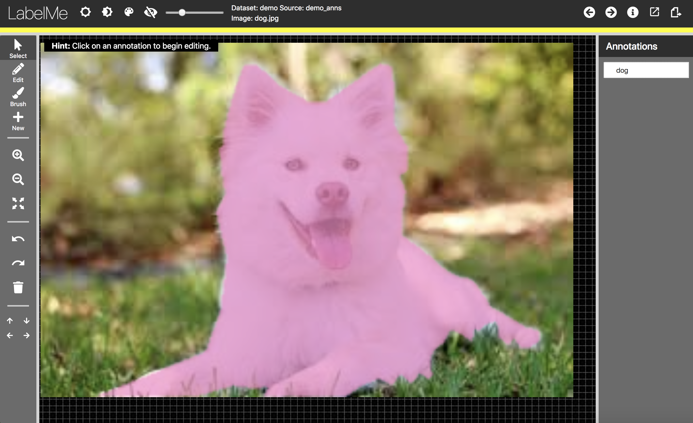

# LabelMe-Lite

A lightweight image annotation tool. Live demo [here](http://labelmelite.csail.mit.edu).



## Running Locally

Make sure you have [Node.js](http://nodejs.org/) installed.

```sh
git clone https://github.com/hujh14/LabelMe-Lite.git # or clone your own fork
cd LabelMe-Lite
npm install
npm start
```

Your app should now be running on [localhost:3000](http://localhost:3000/).

## Adding dataset

```sh
To Do.
```